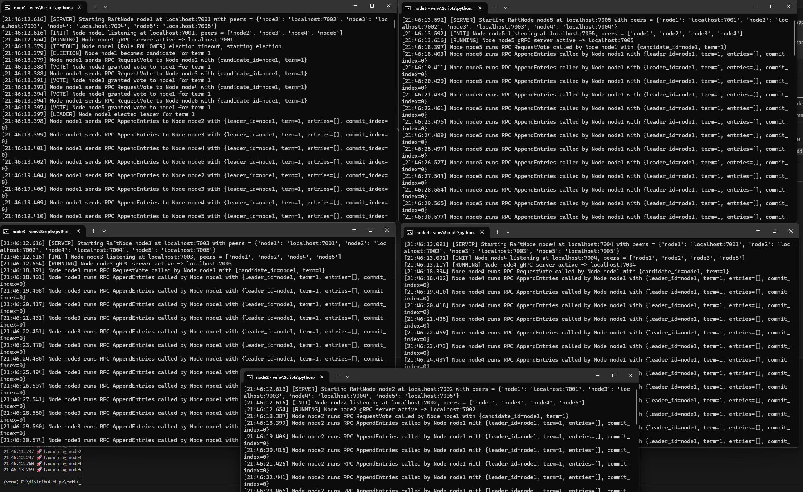
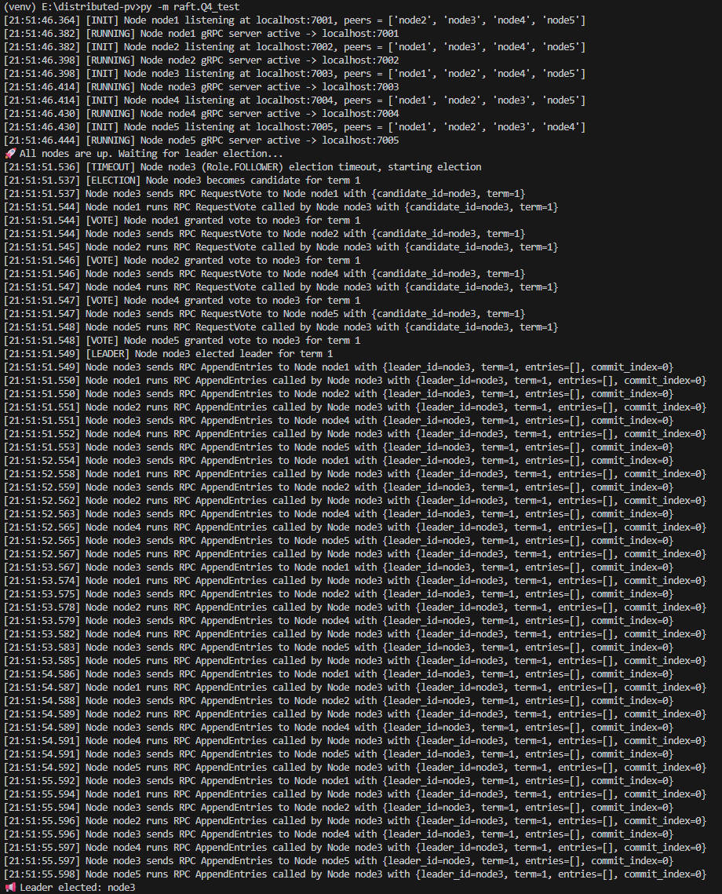
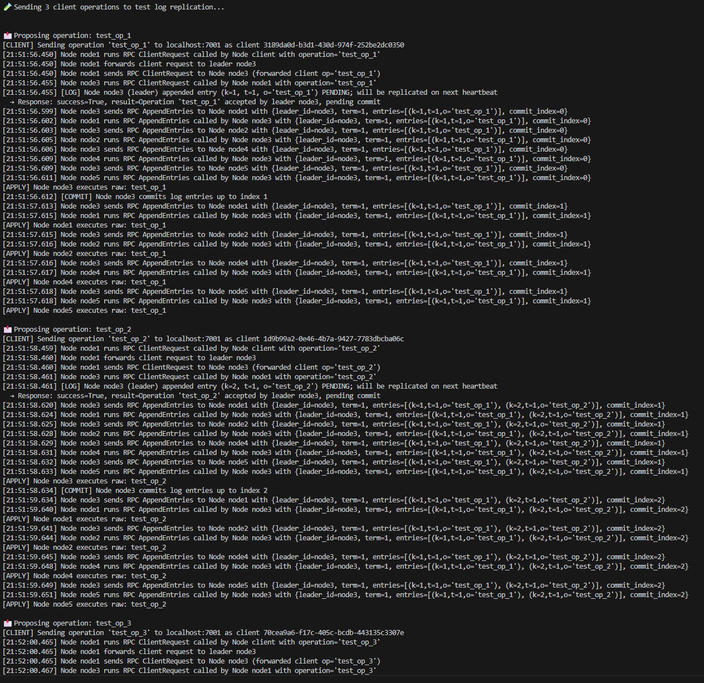
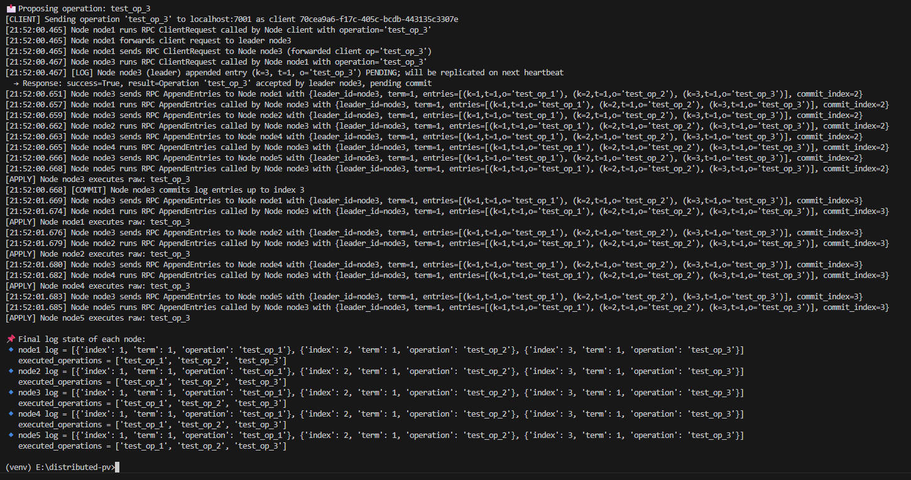
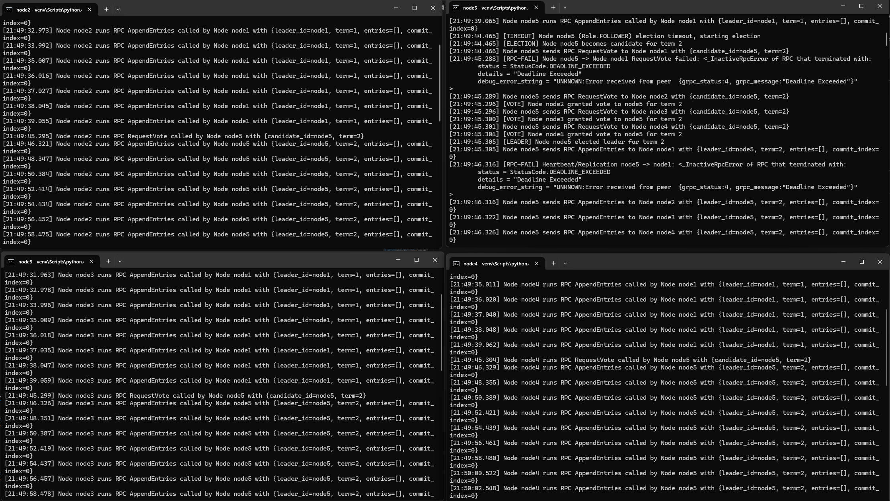
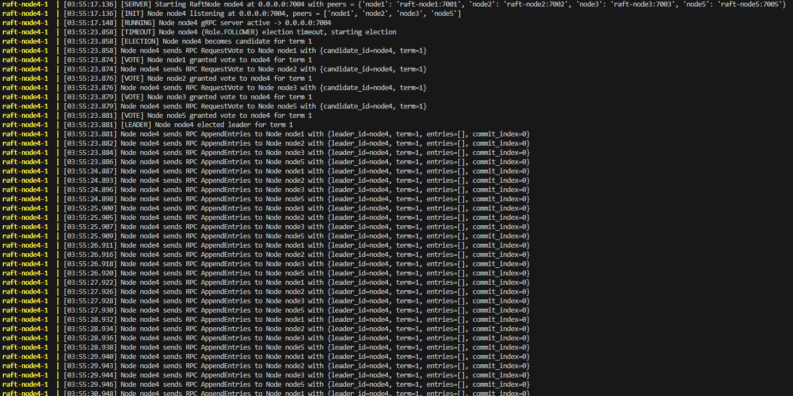
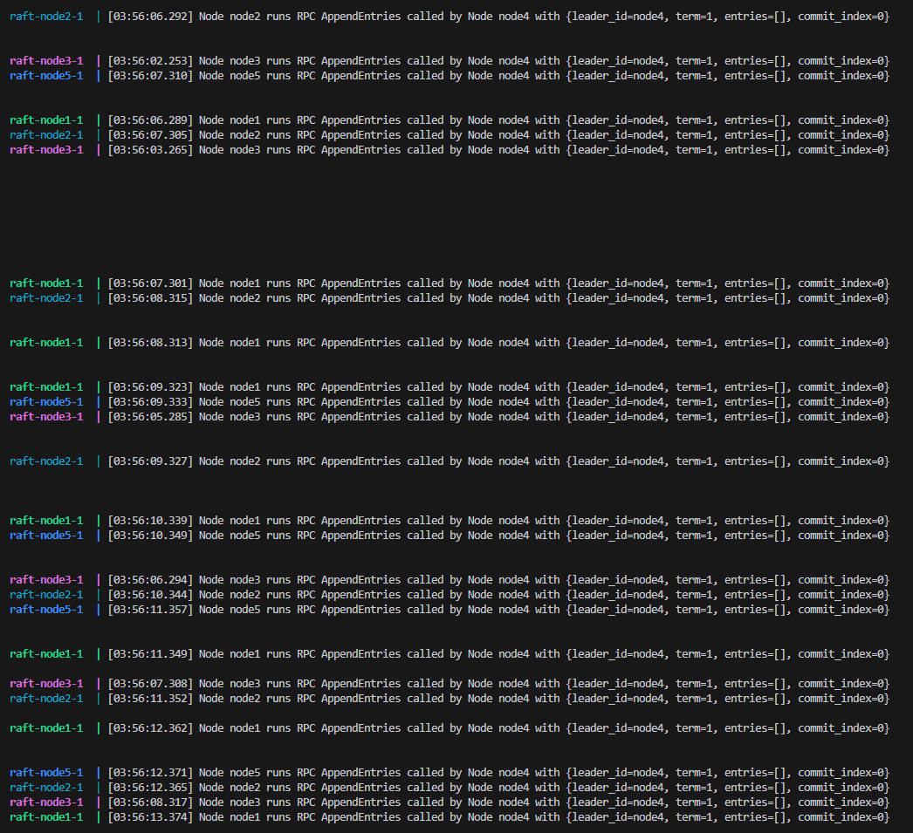
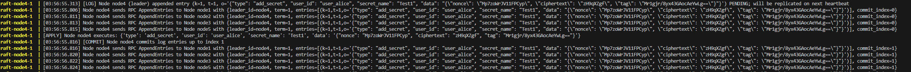
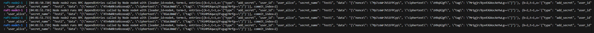

# Report for Project 3

Group 7: Weiran Zhang, Hongzhuo Chen

GitHub link to this project: https://github.com/Richardchen714/distributed-pv

## Two-Phase Commit (2PC) with gRPC (Voting + Decision Phases)

This project extends the distributed-pv system by implementing a fully working Two-Phase Commit (2PC) protocol using gRPC.

It supports:
- Voting Phase (Q1)
- Decision Phase (Q2)
- Cross-language compatibility by using a shared .proto file
- 5+ containerized nodes that communicate over gRPC
- A coordinator that runs the full 2PC protocol and logs all RPC calls

Each node runs two internal services:
1. Participant-Vote Phase Service
2. Participant-Decision Phase Service

Both services are gRPC servers running inside the same container, communicating only through gRPC.

## Overview of the Two-Phase Commit Protocol

A 2PC transaction has two phases:

### Phase 1 — Voting Phase

The Coordinator sends a Vote RPC request to all participant nodes.
Each Participant responds with:
1. VOTE_COMMIT — ready to commit
2. VOTE_ABORT — cannot commit

This is implemented with the RPC method:

```scss
rpc Vote(TxRequest) returns (VoteResponse)
```

### Phase 2 — Decision Phase

1. Coordinator gathers all votes:
   - If all commit, send GLOBAL_COMMIT
   - If any abort, send GLOBAL_ABORT
2. Each participant receives the decision and:
   - Commits (if global commit)
   - Aborts (if global abort)

This phase uses:

```scss
rpc Decide(Ack) returns (Ack)
```

## Logging Requirements (Implemented)

Every RPC prints logs in exactly this format:

### Client side

```php-template
Phase <phase_name> of Node <node_id> sends RPC <rpc_name> to Phase <phase_name> of Node <node_id>
```

### Server side

```php-template
Phase <phase_name> of Node <node_id> sends RPC <rpc_name> to Phase <phase_name> of Node <node_id>
```

All vote and decision RPCs produce these logs automatically.

## Container Architecture

Each participant node runs two internal gRPC servers:
|Service|Port|	Purpose|
|--|--|--|
|vote_server.py|50051|Handles Vote phase
|decision_server.py|60051|Handles final decision|

Coordinator uses the same .proto and connects to each node at these ports.

## Configuration

Each node uses two environment variables:
|Variable|Purpose|
|-|-|
|`NODE_ID`|Identifies the node
|`VOTE`	|Either COMMIT or ABORT|
|`VOTE_PORT`	|Port of voting server|
|`DECISION_PORT`	|Port of decision server|

Example in `docker-compose.yml`:
```yml
environment:
  - NODE_ID=node4
  - VOTE=ABORT
```
You can force an abort by setting `VOTE=ABORT`.

## How to Run

1. Build images

From the root folder (2pc-grpc/):
```bash
docker-compose build
```
2. Start the system
```bash
docker-compose up
```

This launches:
- 5 participant nodes
- 1 coordinator

The coordinator waits a few seconds and automatically starts 2PC for transaction:
```
tx-001
```

3. Read the output logs

You will see messages such as:
- Voting Phase:
```
Phase Coordinator of Node coordinator sends RPC Vote to Phase Participant-Vote of Node node1
Phase Participant-Vote of Node node1 sends RPC Vote to Phase Coordinator of Node coordinator
Phase Coordinator of Node coordinator received VoteResponse from node1: VOTE_COMMIT
```
- Decision Phase:
```
Coordinator decision for tx tx-001: GLOBAL_ABORT
Phase Coordinator of Node coordinator sends RPC Decide to Phase Participant-Decision of Node node4
Phase Participant-Decision of Node node4 sends RPC Decide to Phase Coordinator of Node coordinator
Participant-Decision Node node4: aborting transaction (tx ack from coordinator).
```

### Changing Votes to Test Behavior
To simulate different outcomes, edit docker-compose.yml:
Example: make node4 abort
```yml
node4:
  environment:
    - VOTE=ABORT
```
Example: all commit
```yml
node4:
  environment:
    - VOTE=COMMIT
```
Then rebuild & restart:
```bash
docker-compose down -v
docker-compose up --build
```

## Expected Scenarios
|Node Votes|Coordinator Decision|Behavior|
|-|-|-|
|All COMMIT|GLOBAL_COMMIT|All participants commit|
|One or more ABORT|GLOBAL_ABORT|All participants abort|

## Raft Consensus Protocol (Q3–Q5)

This project integrates **Raft consensus algorithm** into the distributed password vault, ensuring strong consistency across nodes during secret operations.

It supports:

- **Leader election (Q3)**
- **Log replication using gRPC heartbeat (Q4)**
- **Client request forwarding (when request hits a follower)**
- **Leader crash recovery**
- **Integration with Password Vault microservice (Q5)**

Raft nodes are fully containerized using Docker and communicate via gRPC.

---

##  Raft Core Components

| File | Description |
|------|-------------|
| `raft/raft_node.py` | Core Raft implementation (election + replication) |
| `raft/raft_server.py` | Entrypoint to start each Raft node |
| `raft/raft_integration.py` | Interface between Raft and application layer |
| `raft/Q3_test.py` | Demonstrates Raft leader election only (no log replication) |
| `raft/Q4_test.py` | Local in-process test (leader election and log replication) |
| `test_raft_addsecret.py` | Final demo: Add Secret via Raft replication |

---

## 🔌 Raft Cluster Architecture (5 Nodes)

| Node ID | Container Name | Address |
|--------|----------------|---------|
| node1 | `raft-node1` | `raft-node1:7001` |
| node2 | `raft-node2` | `raft-node2:7002` |
| node3 | `raft-node3` | `raft-node3:7003` |
| node4 | `raft-node4` | `raft-node4:7004` |
| node5 | `raft-node5` | `raft-node5:7005` |

Each node is aware of all other nodes through `docker-compose.yml`.

---

## Implementation Details
### Raft Message Formats
```
RequestVote RPC
{
  candidate_id: <Node requesting vote>,
  term: <Current election term>
}

AppendEntries RPC
{
  leader_id: <Current leader node>,
  entries: [
    {
      k: <Index of log entry>,
      t: <Term when entry was added>,
      o: <Client operation stored>
    }
  ],
  commit_index: <Most recently committed index>
}

```
### Leader Election Workflow
```
heartbeat timeout:1s
Election timeout = random between 5.0 ~ 9.0 seconds(Election timeout was extended to 5–8 s (instead of the standard 1.5–3 s) to avoid split‐vote instability during local Docker testing)

node1: didn't received node3 appendentry(heartbeat1), reach it election timeout, become candidate -> send requestvote RPC to node2/3/4/5(heartbeat6.5) -> received OK from node2/3/4/5(heartbeat7.5)， become leader

node2: didn't received node3 appendentry(heartbeat1), didn't reach it election timeout->received node1 requestvote RPC(heartbeat6.5) -> send OK to node1(heartbeat7.5)

node3: crash(heartbeat1) -> --- -> ----

node4: didn't received node3 appendentry(heartbeat1), didn't reach it election timeout->received node1 requestvote RPC(heartbeat6.5) -> send OK to node1(heartbeat7.5)

node5: didn't received node3 appendentry(heartbeat1), didn't reach it election timeout->received node1 requestvote RPC(heartbeat6.5) -> send OK to node1(heartbeat7.5)
```

### Log Replication Workflow
```
node1/node2/node3(leader)/node4/node5

Workflow: new client request2 -> node1 -> forward request to node3(next heartbeat) -> node3(received forwarded request->update current entry(request2 pending)), multicast appendentry RPC to other nodes(1/2/4/5)(next heartbeat) -> other nodes commit request1 and update their log entry, send ACK to node3(next heartbeat) -> node3 commit request2 and update entry(c: The index of the most recently committed operation)

node1: received node1 appendentry/received client request(heartbeat0) -> forward request to node3(heartbeat1) -> received node1 appendentry RPC(heartbeat2) -> commit request1, send ACK(heartbeat3)

node2: received node1 appendentry(heartbeat0)->received appendentry(heartbeat1)->received node3 appendentry RPC(heartbeat2) -> commit request1, send ACK(heartbeat3)

node3: sent appendentry to node1/2/4/5(heartbeat0)->received forwarded request2(latest committed request1)(heatbeat1), update current entry(request2 pending)->multicast appendentry RPC to other nodes(1/2/4/5)(heartbeat2)->node3 received ACK, commit request2 and update entry(c: The index of the most recently committed operation)(heartbeat3)

node4: received node1 appendentry(heartbeat0) -> received appendentry(heartbeat1) -> received node3 appendentry RPC(heartbeat2) -> commit request1, send ACK(heartbeat3)

node5: received node1 appendentry(heartbeat0) -> received appendentry(heartbeat1) -> received node3 appendentry RPC(heartbeat2) -> commit request1, send ACK(heartbeat3)
```


##  Test Cases

| Test Case | Description |
|-----------|-------------|
| **TC1 – Q3 Leader Election** | Start Raft cluster and observe automatic leader selection |
| **TC2 – Q4 Log Replication** | Send operations to leader and verify log commitment across all nodes |
| **TC3 – Leader Crash Recovery** | Stop leader container, verify re-election |
| **TC4 – System Initialization (5 Raft nodes + Microservices of Password App)** | Start complete system including 5 Raft nodes + Password microservices |
| **TC5 – Add Secret via Raft** | Perform password add using `test_raft_addsecret.py`, replicated via Raft |


---

##  Test Cases details
### TC1 – Leader Election
- Screenshot



### TC2 – Log Replication
- Screenshot





### TC3 – Leader Crash Recovery
- Screenshot



### TC4 – System Initialization (5 Raft nodes + Microservices of Password App)
- Screenshot




### TC5 – Add Secret via Raft
- Screenshot




## Lessons Learned & Implementation Challenges
During implementation, we discovered that using the standard Raft election timeout configuration of 1.5–3.0 seconds (as recommended in theoretical Raft papers and assignment specification) led to frequent split-vote occurrences and unstable leader selection behavior.
This is likely due to simulation on a single local PC, where multiple Raft nodes compete for computational resources, introducing timing inconsistencies.

To address this problem, we extended the election timeout to 5.0–9.0 seconds, which:

- Eliminated unstable election cycles
- Allowed clean observation of leader re-election after failures
- Prevented frequent split votes during startup